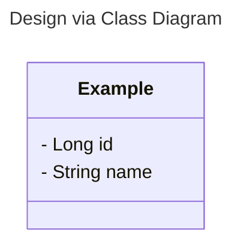
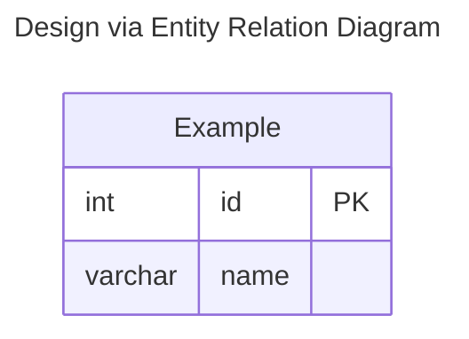

# Issue Name

## Context

Explain what the feature should do and why it should do it.

## Design

## Process

Describe or draw the process that needs to be followed for the specific usecase of the issue.

## Acceptance Criteria

- [ ] Add needed acceptance criteria like endpoint naming, restrictions, happy and unhappy path outcomes, ...

## Getting Started
- [ ] Create a new Branch from main via Github.com
- [ ] Use the prompt to locally navigate to the new branch and change the upstream
- [ ] Start developing WITH tests
- [ ] Send pull request
- [ ] Wait for review
- [ ] Merge with main when review and tests have passed
